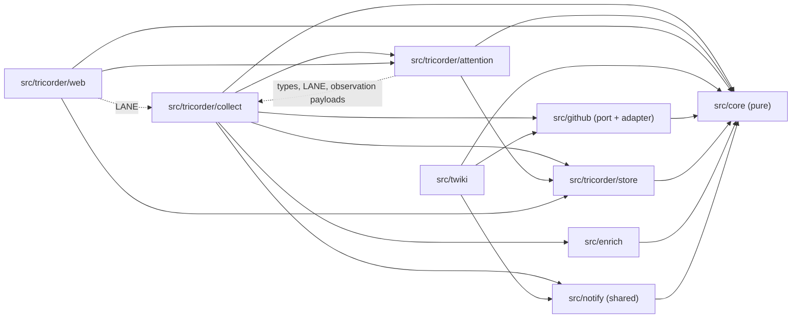

# Architecture Spine: gitricorder attention overview

## Design Paradigm

Ports-and-adapters with a pure core, as the codebase already is. Nothing here changes the paradigm; the new work lands in the existing layers plus one new read-side module and one new shared module.

| Layer | Directory | What lands there from this spine |
| --- | --- | --- |
| Pure core | `src/core/` | `broken` chain term, `tier()`, `runVerdict()`, `isDefaultBranchRef()`, `watchKey()` (moved), PR classifier, kind-to-topic and reason tables, `defaultBranch` config field |
| GitHub port and adapter | `src/github/` | Read methods for code scanning alerts, secret scanning alerts, open pull requests; `listInstallationRepos` returns `defaultBranch` |
| Read side, collection | `src/tricorder/collect/` | Shared run lifecycle helper, three new lanes, the notify lane, actions lane retention change |
| Read side, attention | `src/tricorder/attention/` (new) | Queue builder (moved from `web/queue.ts`), `kev-lookup.ts`, `freshness.ts`, `payloads.ts` (moved), per-repository tiers, tile counts, page summaries, link builder, lane-to-topic map keyed by the `LANE` constants. Reads the store port and `collect/` types only; imported by web and by the notify lane |
| Read side, store | `src/tricorder/store/` | Subject types written: `pull_request`, `notification_sent`, per-lane repository confirmations |
| Read side, web | `src/tricorder/web/` | Pages only: overview, filters, tier rendering, external links, document titles |
| Shared | `src/notify/` (new) | Transports and the deduping wrapper, moved out of `src/twiki/` |
| Write side | `src/twiki/` | Digest gains a dashboard link per repository |

New `AD` ids start at AD-29; the highest id the code cites today is AD-28. Nothing is renumbered.

## Inherited Invariants

| Inherited | From | Binds here |
| --- | --- | --- |
| AD-3 | `src/tricorder/web/app.ts` | No GitHub call and no store write on the request path. Every page renders from the projection. |
| AD-5 | `biome.json`, `test/boundaries.test.ts` | The module boundary is lint-enforced. Every new directory gets an override and a `BOUNDARIES` entry. |
| AD-15 | `src/enrich/port.ts` | Non-GitHub HTTP is confined. Amended by this spine to "only `src/enrich` and `src/notify`". |
| AD-16 | `src/core/log.ts`, `backoff.ts` | A lane never throws past its boundary; outcomes are `ok`, `partial`, `failed`. |
| AD-19 | `src/core/config.ts` | No user or bot login literal in source; logins come from `repos.yaml` only. |
| AD-20 | `src/core/rank.ts` | The urgency chain is lexicographic, its order is code, absent ranks as unknown never as zero risk, no composite score. Amended by AD-30: the tier cut joins the EPSS bands as the second and last configuration value. |
| AD-21 | `src/github/auth.ts`, `src/tricorder/doctor.ts` | twiki and gitricorder are separate GitHub Apps; gitricorder's holds zero write permissions. Restated by AD-38. |
| AD-22 | `src/core/subject.ts` | One key function per subject type. |
| AD-23 | `src/tricorder/collect/workflow-runs.ts` | Actions lane supersession. Amended by AD-30 for the default branch. |
| AD-24, AD-25 | `src/github/discipline.ts` | Request discipline and conditional requests apply to every new port method. |
| AD-26 | `src/tricorder/store/sqlite-store.ts` | The collector process is the sole store writer; the web process holds a read-only handle. |
| AD-27 | `src/tricorder/store/port.ts` | Readers go through the store port; no SQL outside `src/tricorder/store/`. |
| AD-28 | `src/tricorder.ts` | Absence is loud: "never looked" and "nothing found" are never the same picture. |
| UX spine | `docs/design/gitricorder-ux/EXPERIENCE.md` | Tiers are buckets over the chain; six topics; filters are query parameters; no client JavaScript; no auto-refresh; external links open a new tab; review requests stay on `/reviews`. Corrected upstream in the same change that lands this spine: the `now` cut default is 10% (AD-29); other-branch CI failures do not make a repository `soon` (AD-31); the review budget is an explicit tier input measured from the pull request's `createdAt` (AD-29); a plain pull request whose checks are not observed is not `soon` (AD-31); only the three security topics can read `not covered` (AD-35); Flow 1's failure path reads that the message was sent on an earlier sweep when the repository was `now` (AD-37). |

## Invariants & Rules



Arrows read "may depend on". `src/core` depends on nothing in the tree; `src/notify` and `src/enrich` depend only on `src/core`. `src/tricorder` and `src/twiki` never import each other. Dotted edges are type-only and constant-only imports (`LANE` names, observation payload types), expressed in Biome's restricted-imports rule with `importNamePattern` so only `type` imports and the `LANE` names pass; `attention` and `web` never call a lane. `src/tricorder/web` never imports `src/notify` or `src/github`. `attention` never imports `src/github`, `src/notify` or `src/tricorder/web`. The lint boundary (AD-5) gains an override for `src/notify/**` and `src/tricorder/attention/**`, `**/notify/**` joins the restricted groups of `src/core`, `src/github` and `src/enrich`, and `test/boundaries.test.ts` gets a `BOUNDARIES` entry for each; the story that creates `attention/` owns those edits.

### AD-29: A repository's tier is the highest tier over its open queue items

- **Binds:** overview, repo-page, notifier, `src/core/tier.ts`, `src/tricorder/attention`
- **Prevents:** the overview and the queue disagreeing on order; a tile count, a row tier and a page summary disagreeing on one page; a severity floor or any second ranking deciding attention
- **Rule:** `tier(ranking: Ranking, cut: number): Tier` is pure, in `src/core`, and evaluates one item from the term ranks the chain already produced: `now` when the `broken` term is true, or the KEV term is listed, or the EPSS term's rank is at or above the rank of the cut band; `soon` when any term's rank is above `LEAST_KNOWN`, which includes unknown; `quiet` when every term is at `LEAST_KNOWN`. A repository's tier is the maximum over its open items, `now` > `soon` > `quiet`, raised to at least `soon` when it has a review request older than the review budget. The rationale line names the first item in chain order that attains the repository's tier. Every reader of a tier (overview row, tile `now` marker, page summary, repo-page header, document title, notifier) reads the one result `src/tricorder/attention` computes. The cut is a probability, `TRICORDER_NOW_EPSS`, default `0.1`; startup fails with a named error unless it equals one of the configured EPSS bands, and it is turned into a term rank once at startup with the exported `epssRank(cut, bands)`, so the function signature is `tier(ranking, cutRank)`. The review budget is `TRICORDER_REVIEW_BUDGET_DAYS`, default `3`, compared against the pull request's `createdAt`, the only time the review payload carries; the rationale reads `pull request open 9d, review requested`. This supersedes the UX spine's "top band (0.5)" cell; decided on live EPSS data.

### AD-30: The chain gains `broken` as its first term, fed by a default-branch retention rule

- **Binds:** `src/core/rank.ts`, actions lane, `src/tricorder/attention`
- **Prevents:** CI failures ranked outside the chain; a PR-branch run superseding the last default-branch run so a red `main` reads as no run
- **Rule:** Chain order is `broken`, KEV, EPSS band, severity, bump, stuck. Order stays code. Severity stays third: a critical alert below the cut is `soon`. The actions lane retains, per repository and workflow, two current rows: the newest run whose head branch is the configured default branch, and the newest run on any other branch; supersession is per (workflow, on-default-branch) and a PR-branch run never supersedes a default-branch run. The lane reads the default branch from config and stores it nowhere. Both retained rows come from the one unfiltered page of the newest 100 runs the lane already fetches; no second request. A default-branch run older than that window keeps its stored row, and on every 200 whose page was read completely (no unreadable rows, not truncated) the lane touches the `verifiedAt` of each retained row the page did not supersede, because a complete page is evidence that the row is still its bucket's newest. `broken` is per workflow, from stored observations only: true when the retained default-branch run's `runVerdict` is `failed` or `hung`; false when it is `passed`; `null` when it is `other`. A workflow with no default-branch row under a fresh confirmation has no `broken` value and no item. Only true reaches the chain (AD-31); false, `null`, a missing confirmation and `workflows: null` render on the repo page as the run's own words and on the CI chip as `unconfirmed` or a count through the confirmation (AD-35). This is a deliberate narrowing of AD-20 for CI: the confirmation carries the unknown, not the chain. `broken` inherits the Actions lane's hourly cadence and the CI topic renders freshness on that lane's policy. The AD-20 comment in `rank.ts` is amended in the story that adds the cut.

### AD-31: Every queue kind maps onto existing terms, with per-kind wording

- **Binds:** collectors, `src/tricorder/attention`, `src/core/rank.ts`, `src/core/topics.ts`
- **Prevents:** a kind inventing its own rank input or composite score; a secret rendering as "listed in CISA KEV"; a Dependabot PR appearing under two kinds; a rerun creating a new item every hour
- **Rule:** The queue kinds are `alert`, `code_scanning`, `secret_scanning`, `ci_failure`, `update_pr`, `pull_request`, `issue`. Their `RankInput` is fixed by this table:

| Kind | broken | KEV | EPSS | severity | bump | stuck | freshness lane |
| --- | --- | --- | --- | --- | --- | --- | --- |
| `alert` | n/a | catalogue lookup | advisory EPSS | advisory severity | n/a | update status | alerts |
| `code_scanning` | n/a | n/a | n/a | `rule.security_severity_level`; `null` maps to n/a | n/a | n/a | code scanning |
| `secret_scanning` | n/a | listed, always: an open secret is a confirmed exposure | n/a | n/a | n/a | n/a | secret scanning |
| `ci_failure` | per AD-30 | n/a | n/a | n/a | n/a | n/a | actions |
| `update_pr` | n/a | inherited from linked alert | inherited | inherited | PR bump | link error | update PRs |
| `pull_request` | n/a | n/a | n/a | n/a | n/a | `runVerdict` of the retained run for the PR head ref with event `pull_request`: true on `failed` or `hung`, false on `passed`, `n/a` with reason `checks running` on `other`; `n/a` with reason `checks not observed` when no such row exists, a deliberate departure from AD-20 because the run window, not a failed read, is the cause | pull requests |
| `issue` | n/a | n/a | n/a | n/a | n/a | n/a | issues |

Reason strings and display words are per kind: `rank()` takes a reasons table keyed by term, and `src/core/topics.ts` holds one table per kind. `kevListed` is true only for `alert` and `update_pr`. `secret_scanning` renders `critical` on chips without feeding severity; its reason carries `validity` and `publicly_leaked` as words. Lanes store every open alert regardless of ref; the default-branch condition for `code_scanning` (`isDefaultBranchRef(most_recent_instance.ref, defaultBranch)`) is applied by the queue builder only, and the repo page lists every stored alert with its ref. `ci_failure` is one item per (repository, workflow), keyed `owner/name#workflow:<workflowId>`, carrying the deciding run's number and URL; it exists only when that workflow's retained default-branch run has verdict `failed` or `hung`, so its `broken` is always true, and the CI tile counts exactly those items. Other-branch failures stay on the repo page and never affect a tier. A derived item's lifetime is the span during which the builder emits it over fresh evidence. A pull request is exactly one kind: the bot-login classifier from `repos.yaml` (AD-19), implemented once in `src/core`, decides `update_pr`; it normalises the `app/` prefix and the `[bot]` suffix so `app/dependabot` in config matches `dependabot` and `dependabot[bot]` in payloads; the pull-request lane excludes what it matches; when `bots` is empty, bot PRs appear in no kind and the entrypoint says so loudly, as the lanes already do. A PR that changes classification is tombstoned under its old type by the existing node reconciliation on that lane's next `ok` full run. The checks API is never called.

### AD-32: One queue item shape, one topic map, counts over the allowlist

- **Binds:** overview, queue, repo-page, notifier, collectors
- **Prevents:** builders inventing row shapes or topic labels; a de-listed repository's items inflating the tiles; a page summary disagreeing with the chip beside it
- **Rule:** Every kind produces the existing `QueueItem` shape (`kind`, `key`, `repo`, `number`, `packageName`, `title`, `advisory`, `htmlUrl`, `explanation`, `kevListed`, `ranking`, `freshness`, `age`) plus `topic` and `displaySeverity`. The kind-to-topic map in `src/core/topics.ts` is the only source of the topic words, their `topic=` values and their order: `security` = `alert`, `code_scanning`, `secret_scanning`; `ci` = `ci_failure`; `dependencies` = `update_pr`; `pulls` = `pull_request`; `issues` = `issue`; `reviews` has no kind and links to `/reviews`. The lane-to-topic map used for tile attestation lines (`never collected`, `alerts sweep failed 3h ago; counts may be low`) lives in `src/tricorder/attention/lane-topics.ts`, keyed by the `LANE` constants so a lane rename cannot silently unmap it. Every tile count, tier, page summary and `now` marker is computed over items whose repository is in the allowlist, matched by the case-folded slug; the unfiltered queue shows other items under a `no longer watched` heading and they take part in no count. The repo-page summary reads the same items as its chips; the Dependabot lane's own counts are an attestation, never rendered as a total. The unreadable-rows count travels with the built queue and is rendered on every page that shows counts.

### AD-33: The default branch is policy, matched by one function, checked by doctor

- **Binds:** `repos.yaml` schema, actions lane, `src/tricorder/attention`, doctor
- **Prevents:** two builders comparing refs two ways; a config lookup missing on case; a rename going unnoticed
- **Rule:** `repos[].defaultBranch` is an optional strict-parsed string, default `main`. The read side resolves it through one accessor keyed by `watchKey`, which moves to `src/core` so every layer folds a slug the same way; no builder reads `config.policies` directly. `isDefaultBranchRef(ref, defaultBranch)` in `src/core` strips a `refs/heads/` prefix, compares exactly, and returns false for any other ref form. `listInstallationRepos` returns `defaultBranch` from the payload it already pages, and doctor compares it to the configured value per watched repository, naming a mismatch as `repos[i].defaultBranch is main, GitHub says master`; doctor stays write-free. twiki ignores the field in this epic and keeps its own `main` literal; unifying that is a follow-up issue.

### AD-34: Attention is computed in one module, by both processes, and never persisted

- **Binds:** `src/tricorder/attention`, `src/tricorder/web`, the notify lane
- **Prevents:** the web process and the collector process computing tiers differently; a store view that ranks
- **Rule:** `src/tricorder/attention` builds the queue, per-repository tiers, tile counts and page summaries over the store port, `src/core` and `collect/` types only. The web pages and the notify lane both call it; neither computes a tier itself. Tiers are never persisted. Because the two processes read separate environments, the notify lane writes the rank policy, cut and review budget it used as one subject, `attention_policy`, on every run; the web process compares it to its own values and renders `policy mismatch: collector ranks with …, this page with …` above the board when they differ, still rendering with its own values; a stale or absent `attention_policy` row is treated as absent and renders `collector policy not confirmed`.

### AD-35: New lanes use one run lifecycle and one attestation model

- **Binds:** collectors, repo-page attestation, overview `unconfirmed` chips
- **Prevents:** further copies of the inline run lifecycle; three lanes picking three ways to say "we looked"
- **Rule:** The shared lifecycle asked for in #71 is extracted before any new lane is written; new lanes are built on it; existing lanes migrate when touched. Every repository-scoped lane writes a per-repository confirmation subject through the helper (`repository_code_scanning`, `repository_secret_scanning`, `repository_pull_requests`, alongside the existing `repository` and `repository_actions`) so "never looked" is distinguishable per topic. A count chip renders `not covered` when coverage says `off`, else `unconfirmed` when no fresh confirmation exists, else the count; `unconfirmed` replaces the existing `not collected` word and is never rendered as `0`. The two alert lanes list org-level with the per-repository fan-out `listDependabotAlerts` already uses for user accounts; plain PRs come from one search per installation like update PRs; all three run on the alert cadence with `scope: full`. Search ports return `unsearchable` as a list of repository slugs, not a count; the helper confirms every watched repository the search covered and withholds the listed ones, and a truncated search withholds all. Only the three security features can be `not covered`; CI, pull requests and issues render `unconfirmed` or a count. Per-cycle GitHub call floors: code scanning and secret scanning one paged call per org installation per 15 minutes, one per repository on user accounts; pull requests one search per installation; coverage two more calls per watched repository per day; notify zero.

### AD-36: The lane that meets "feature off" owns the coverage field

- **Binds:** code scanning lane, secret scanning lane, coverage lane, `repository_coverage`
- **Prevents:** a 403 or 404 rendering as zero; a `partial` run switching off tombstones for a whole installation because one repository has the feature off
- **Rule:** `repository_coverage` gains `codeScanning` and `secretScanning`, each a `CoverageState` like the existing Dependabot field (`covered`, `alerts_disabled`, `repo_disabled`, `archived`, `unreachable`, `unknown`) with GitHub's own message as the reason. The coverage lane is the sole writer of `repository_coverage`. It probes both features per watched repository with one call each, exactly as it probes Dependabot today, on its daily cadence; a `partial` run sets `retryAfterMs` to one hour like the KEV lane, so a repository left `unknown` by an unreachable probe is retried within the hour rather than every tick or next day. It writes the whole payload; there is no per-field merge because there is no second writer. Org-level alert listings never see a per-repository status, so they never write coverage; on user accounts the fan-out lane that meets 403 or 404 writes no rows and no confirmation for that repository, does not degrade the run, and lists it in the run detail as `skipped, feature off`, leaving the field to the coverage lane. 403 and 404 map to a `CoverageState` by GitHub's message body; an unrecognised message maps to `unknown` with the body as reason, never `off`, because 403 also means the App lacks the permission. `archived` and `repo_disabled` win over every probe at write time. A row written before this change lacks the fields and reads as `unknown`, never `off`. Chip precedence (AD-35): `off` renders `not covered`; `unknown` renders `unconfirmed` even when a confirmation exists. `SCHEMA_VERSION` is unchanged; rollout is collector first, then web.

### AD-37: The notifier is a collector lane with an item-keyed announced set

- **Binds:** notify lane, `src/notify`, `src/twiki/report.ts`, store
- **Prevents:** a store write from the read-only web process; two dedupe rules; a transition rule that needs state nobody persists; re-announcing the same item
- **Rule:** `src/notify/` holds `MatrixTransport`, `WebhookTransport`, `ConsoleTransport` implementing `Notifier`, and `DedupingNotifier` as a wrapper; twiki keeps the wrapper with its file names, env names and `TWIKI_STATE_DIR` semantics unchanged. gitricorder's `notify` lane runs in the collector process after the collection lanes on the same tick, under a pseudo-installation like `kev`, writes its own `collection_run` row, and uses the Matrix transport bare. It runs every tick (store reads only) under a pseudo-installation appended last to the cycle, so it always sees that tick's collection. Trigger is item-keyed: for every queue item whose own tier is `now` and whose repository is in the allowlist, send one message with the repo-page URL when no `present` `notification_sent` row exists for `<kind>:<itemKey>`, and write that row only after the transport returned success. A repository is announced once per item; a KEV catalogue refresh or a tier change never re-announces; an item that resolved and reopened under the same key is announced again. First run is detected by the absence of a `notify_seeded` marker subject, never by an empty set: the first run writes the marker and the seed rows in one transaction, sends nothing, and logs the count. A `notification_sent` row is tombstoned when its item's subject is tombstoned or, for derived items, when the item disappears from a queue built over fresh evidence. twiki's digest appends the repo-page URL per repository from its own base-URL setting. gitricorder supports Matrix only; `TRICORDER_MATRIX_HOMESERVER`, `TRICORDER_MATRIX_TOKEN`, `TRICORDER_MATRIX_ROOM` and `TRICORDER_BASE_URL` are all-or-nothing, validated at startup with a named error, and when unset the lane is absent loudly like the reviews lane without `reviewers`. The transport never interpolates the token into an error, and `redact()` gains redaction of the configured token value.

### AD-38: Read-only toward GitHub, and no new permissions

- **Binds:** doctor, `src/github/port.ts`, App configuration, `README.md`
- **Prevents:** a lane or the notifier acquiring a GitHub write; permission creep for the new endpoints
- **Rule:** gitricorder's only outbound write is to the notification transport. `doctor` keeps failing on any write permission. The new port methods use only reads already in `REQUIRED_READS`: `security_events` (code scanning), `secret_scanning_alerts`, `pull_requests`, `actions`, `metadata`. No name is added. The AD-21 sentences in `doctor.ts` and `README.md` ("must not be able to change anything", "grant no write permission at all") are amended in the notifier story to say "toward GitHub".

### AD-39: Internal links have one grammar and one builder

- **Binds:** queue, overview, repo-page, notifier
- **Prevents:** three link builders encoding a repository or topic three ways; a mixed-case link rendering the empty state
- **Rule:** `topic` takes one of the five queue topic values; `repo` takes the case-folded `owner/name`. An unknown value renders the empty-filter state with status 200. One helper in `src/tricorder/attention` builds every internal path (queue with filters, repo page) and joins `TRICORDER_BASE_URL` for absolute URLs; it emits `watchKey(repo)` and the allowlist check folds. No page or lane concatenates a path by hand.

### AD-40: External links are one component, behind one scheme filter

- **Binds:** every page
- **Prevents:** one page forgetting `rel`, another the marker, a third the accessible name; five inline scheme checks drifting
- **Rule:** A single `ExternalLink` JSX component renders every link out of gitricorder with `target="_blank"`, `rel="noopener noreferrer"`, the marker glyph and the visually hidden suffix from the UX spine. The five inline `https://` checks collapse into the one helper `repo-view.ts` already has, and `ExternalLink` calls it. No page writes `<a target>` itself.

### AD-41: One verdict for a workflow run

- **Binds:** actions lane, `src/tricorder/attention`, `src/core/run-verdict.ts`
- **Prevents:** two definitions of "stalled"; an unstated conclusion vocabulary; the lane's `failing` counter and the CI tile disagreeing
- **Rule:** `runVerdict(run, now, hungAfterMs)` in `src/core` returns `failed` for conclusion `failure`, `timed_out` or `startup_failure`; `passed` for `success`; `hung` for status other than `completed` with `createdAt` older than `hungAfterMs`, which callers pass as twice the Actions cadence; `other` for every other conclusion (`cancelled`, `skipped`, `neutral`, `action_required`, `stale`) or a fresh in-progress run. The lane's `failing` counter, the `broken` term and the `pull_request` stuck term all call it. `failing` counts retained default-branch rows with verdict `failed` or `hung`, is an attestation, and is rendered only in Collection health detail, never as a total beside queue items. The word `stalled` is reserved for lane runs in the Collection health table; a workflow run is `hung`.

## Consistency Conventions

| Concern | Convention |
| --- | --- |
| Subject types | snake_case names in `src/core/subject.ts`; alert-like subjects keyed `owner/name#number`, node-backed subjects keyed by GraphQL node id, repository-scoped subjects keyed by case-folded slug. New: `pull_request` (node id), `notification_sent` (`<kind>:<itemKey>`), `notify_seeded` and `attention_policy` (constant keys like `kev_catalogue`), `repository_code_scanning`, `repository_secret_scanning`, `repository_pull_requests` (slug). No `subject_type` CHECK constraint exists; adding a type is a tuple entry. One lane writes a subject type; a fact another lane learns goes into that lane's own subject and the reader joins. |
| Lane names | GitHub lanes carry a transport prefix (`rest-…`, `graphql-…`); `coverage`, `kev` and `notify` do not. One lane per subject type; cadence constants in `src/tricorder.ts`. |
| Open items | Lanes request open items only; the queue reads projection state `present` only; payload `state` is informational. Code scanning `state` may be `null`. |
| Signals | `Signal<T>` tri-state everywhere: value, `n/a` (nothing to know), `null` (unknown). A kind that cannot know a term uses `n/a`; a kind that failed to learn it uses `null`. |
| Env | `TRICORDER_*` for the read side, `TWIKI_*` for the write side, each read once at startup through the existing parse helpers with a named error on bad input. Base URLs are `https://` only, like `TRICORDER_KEV_URL`. |
| Config | `repos.yaml` stays strict zod; every new field is optional with a documented default. |
| Errors and outcomes | Lanes never throw; `ok` / `partial` / `failed` with a redacted reason. Web routes never 500 on user input. |
| Times | ISO 8601 UTC strings in the store; relative ages only at render, through the existing `ageLabel`, including the clock-skew wording. |
| Tests | Flat `test/`, one file per concern; fakes extended in `test/fakes.ts`. Required by this spine: a contract test per new port method against recorded payloads before a lane uses it; a table test for `tier()` over every term state; the lifecycle helper and `runVerdict()` under the mutation battery; the notify lane against a fake transport, including the silent first seed; doctor's default-branch check; a coverage read of an old-shape row. |

## Stack

Brownfield; versions are what `package.json` and the lockfile pin today, verified against the npm registry on 2026-09-07. The code owns these.

| Name | Version |
| --- | --- |
| Node.js | >= 24 (distroless `nodejs24-debian12`) |
| TypeScript | 7.0.2 |
| hono / @hono/node-server | 4.13.5 / 2.1.1 |
| @octokit/rest, @octokit/graphql, @octokit/auth-app | 22.0.1 / 9.0.5 / 8.3.0 |
| node:sqlite | bundled with Node 24, `ExperimentalWarning` already suppressed by name |
| zod | 4.5.4 |
| yaml | 2.9.0 |
| vitest | 4.1.11 |
| Biome | 2.5.11 |

## Structural Seed

```text
src/
  core/
    rank.ts            # + broken term, reasons table parameter
    tier.ts            # new: tier(ranking, cut)
    run-verdict.ts     # new: runVerdict(run, now)
    topics.ts          # new: kind-to-topic, per-kind reasons and display severity (lane-to-topic lives in attention/)
    branch.ts          # new: isDefaultBranchRef
    pr-classifier.ts   # new: bot-login classifier shared by update-PR and pull-request lanes
    config.ts          # + repos[].defaultBranch, folded accessor
    subject.ts         # + pull_request, notification_sent, notify_seeded, attention_policy, per-lane repository confirmations
    slug.ts            # watchKey moved here from collect/
    redact.ts          # + configured-token redaction
  notify/              # new: transports + DedupingNotifier wrapper, moved from src/twiki/notify.ts
  github/
    port.ts            # + listCodeScanningAlerts, listSecretScanningAlerts, listOpenPullRequests; listInstallationRepos returns defaultBranch
    octokit-adapter.ts
  tricorder/
    collect/
      lifecycle.ts     # new: shared run lifecycle (#71), writes per-repo confirmations
      code-scanning.ts # new lane
      secret-scanning.ts
      pull-requests.ts
      notify.ts        # new lane: tier transitions to Matrix
      workflow-runs.ts # two retained rows per workflow (AD-30)
      coverage.ts      # per-feature CoverageState
    attention/         # new: queue.ts, kev-lookup.ts, freshness.ts, payloads.ts (moved), tiers.ts, summaries.ts, links.ts, lane-topics.ts
    store/             # subject types only; SCHEMA_VERSION unchanged
    web/
      view.ts          # overview rows from attention
      components.tsx   # ExternalLink, tiles, chips, tier chip, legend, titles
  twiki/
    report.ts          # + dashboard link per repo
```

```mermaid
erDiagram
  REPOSITORY ||--o{ DEPENDABOT_ALERT : has
  REPOSITORY ||--o{ CODE_SCANNING_ALERT : has
  REPOSITORY ||--o{ SECRET_SCANNING_ALERT : has
  REPOSITORY ||--o{ WORKFLOW_RUN : "has, two retained per workflow"
  REPOSITORY ||--o{ PULL_REQUEST : has
  REPOSITORY ||--o{ DEPENDENCY_UPDATE_PR : has
  REPOSITORY ||--o{ ISSUE : has
  REPOSITORY ||--|| REPOSITORY_COVERAGE : "dependabot, codeScanning, secretScanning"
  REPOSITORY ||--o| REPOSITORY_ACTIONS : confirms
  REPOSITORY ||--o| REPOSITORY_CODE_SCANNING : confirms
  REPOSITORY ||--o| REPOSITORY_SECRET_SCANNING : confirms
  REPOSITORY ||--o| REPOSITORY_PULL_REQUESTS : confirms
  REPOSITORY ||--o{ NOTIFICATION_SENT : announced
  KEV_CATALOGUE ||--o{ DEPENDABOT_ALERT : lists
```



Deployment is unchanged: one distroless image, two roles, one SQLite file in WAL mode, the collector as sole writer, gitricorder web on loopback behind whatever fronts `twiki.app.labmonkeys.space`. Added settings: `TRICORDER_BASE_URL`, `TRICORDER_MATRIX_HOMESERVER`, `TRICORDER_MATRIX_TOKEN`, `TRICORDER_MATRIX_ROOM`, `TRICORDER_NOW_EPSS`, `TRICORDER_REVIEW_BUDGET_DAYS`, and a `TWIKI_DASHBOARD_URL` for the digest link. No new service, no new process. Rollout order: extract the lifecycle, land core functions, land lanes and the attention module in the collector, then the web pages; an old web reading new rows ignores the new kinds, which is safe.

## Capability → Architecture Map

| Capability / Area | Lives in | Governed by |
| --- | --- | --- |
| Overview with tiers, tiles, legend, quiet block | `attention/`, `web/view.ts`, `web/components.tsx`, `core/tier.ts` | AD-29, AD-32, AD-34, AD-40 |
| Queue filters | `attention/queue.ts`, `attention/links.ts` | AD-31, AD-32, AD-39 |
| Repo page sections, header, summary | `attention/summaries.ts`, `web/repo-view.ts` | AD-32, AD-34, AD-35, AD-36 |
| Reviews page (title, landmarks, hit areas, external links) | `web/review-view.ts` | UX spine, AD-40 |
| CI failures as a kind | `core/rank.ts`, `core/run-verdict.ts`, `collect/workflow-runs.ts`, `attention/` | AD-30, AD-31, AD-33, AD-41 |
| Code scanning and secret scanning | `github/`, `collect/`, `store/` | AD-31, AD-35, AD-36, AD-38 |
| Plain pull requests | `github/`, `collect/pull-requests.ts`, `core/pr-classifier.ts` | AD-31, AD-35 |
| Default branch | `core/config.ts`, `core/branch.ts`, `doctor.ts` | AD-33 |
| Notifications | `src/notify/`, `collect/notify.ts`, `twiki/report.ts` | AD-37, AD-38, AD-39 |
| App permissions | `doctor.ts` | AD-38 |
| Honesty states (`unconfirmed`, `not covered`, failed-lane tile line, unreadable rows) | `attention/`, `web/components.tsx`, `core/topics.ts` | AD-32, AD-35, AD-36 |
| Dark colors, rem ramp, accessibility floor | `web/components.tsx` | UX spine (DESIGN.md Colors, EXPERIENCE.md Accessibility Floor) |

## Deferred

- Notification message wording. The UX voice table governs it; story level.
- Whether existing lanes migrate to the shared lifecycle in one refactor story or opportunistically. AD-35 requires only the extraction before new lanes.
- Retention for the new subject types beyond tombstone-on-item-tombstone. They inherit `TRICORDER_RETENTION_DAYS`.
- twiki reading `repos[].defaultBranch` instead of its `main` literal. Follow-up issue; AD-33 fixes the meaning so the two roles cannot drift silently.
- Slack and Discord transports for gitricorder. Matrix only in this epic.
- Whether `doctor` becomes a required deploy preflight step. Operations, outside this feature's altitude.
- The tablet `signals` cell and further rendering detail. Owned by the UX spine, which specifies it fully.
